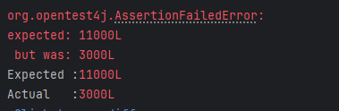

# hanghae99-TDD
- 항해99 1주차 과제 제출용 깃 저장소
- 일정: 2025.03.22 ~ 2025.03.28
- 1주차 과제: TDD & 클린 아키텍처
- 기본 과제: 4가지 기능 작성 및 단위 테스트 작성 
- 심화 과제: 통합 테스트 작성 및 동시 요청이 정상적으로 처리될 수 있도록 개선, 동시성 제어 방식에 대한 보고서 작성 

### 개요
해당 README.md 파일에는 JUnit에서 동시성을 어떻게 테스트하였으며 이를 해결하기 위해 어떤 방식을 적용하였는지에 대한 보고서를 작성하려고 합니다.

### 동시성 문제란 무엇인가?
동시성 문제란 여러 개의 프로세스나 스레드가 동일한 자원에 동시에 접근할 때 발생하는 문제를 의미한다.  

쉽게 말해 하나의 작업에 순간적으로 많은 요청이 들어와 요청을 올바르게 제어하지 못했을 때 일어나는 문제이다.  

멀티스레드 환경이나 분산 시스템에서 특히 많이 발생한다.

### 동시성 문제가 발생하면 어떤 문제가 생기는거지?
1. 데이터 불일치 (Race Condition)
   - 여러 스레드가 같은 데이터를 수정할 때, 실행 순서에 따라 예기치 않은 값이 저장될 수 있음  
   - 논리적으로 잘못된 값을 결과 값으로 내보낼 수 있음


2. 교착상태 (Deadlock)
   - 여러 스레드가 서로의 자원을 기다리면서 무한정 대기하는 상태


3. 데이터 손상 (Data corruption)
   - 두 개 이상의 스레드가 동시에 같은 데이터에 접근하여 값을 변경할 때, 예상치 못한 데이터의 변형이 발생하는 상태
   - 데이터 자체가 깨지는 문제가 발생할 수 있음

<details>
<summary>데이터 불일치와 데이터 손상 차이?</summary>

| **구분**         | **데이터 불일치**                      | **데이터 손상**                    |      
|-----------------|-----------------------------------|-------------------------------------|    
| **발생 원인**     | 동시 접근 시 실행 순서가 꼬임              | 여러 스레드가 데이터 구조를 깨뜨림 |    
| **결과**          | 논리적으로 잘못된 값            | 데이터 자체가 깨짐 (읽기 불가능)          |   
| **예시**          | 계좌 잔액이 틀어짐   | 파일 내용이 깨지거나 충돌       |    

</details>

### 동시성 문제 구현시키기
동시성 문제를 해결하기 전 어떻게 해야 동시성 테스트가 되는지에 대해 정리하려고 한다.

1. ExecutorService 를 사용해서 다중 스레드 실행
- 스레드 개수를 지정하여 동시에 실행 
- `CountDownLatch` 를 이용해 모든 스레드가 동시에 시작하도록 동기화 

<details>
<summary>구현 예시</summary>

```java
import java.util.concurrent.CountDownLatch;

// 동시성 문제 구현 전
void chargePoint() {
   // userPointTable에 데이터 넣어놓은 상태 
   Long chargePoint = 100L;

   UserPoint result = pointService.chargeUserPoint(USER_ID, chargePoint);

   assertThat(result.point()).isEqualTo(기존_보유_포인트 + chargePoint);
}

// 동시성 문제 구현 후 
void chargePointMultiThread() {
   // userPointTable에 데이터 넣어놓은 상태 
   Long chargePoint = 100L;
   int threadCount = 10; // 동시에 요청할 스레드 개수
   ExecutorService executorService = Executors.newFixedThreadPool(threadCount);
   CountDownLatch latch = new CountDownLatch(threadCount); // 스레드 대기 역할

   for (int i = 0; i < threadCount; i++) {
      executorService.submit(() -> {
                 try {
                    pointService.chargeUserPoint(USER_ID, chargePoint);
                 } finally {
                    latch.countDown();
                 }
        });
   }
   
   latch.await(); // 모든 스레드가 종료될 때까지 대기
   executorService.shutdown(); // 스레드 풀 종료
   
   // then
   UserPoint result = userPointTable.selectById(USER_ID);
   assertThat(result.point()).isEqaulsTo(AMOUNT + (chargePoint * threadCount));
}
```
</details>

- 위 구현 예시를 진행하면 아래와 같은 오류가 발생한다.
- 동시 제어가 가능하게 구현하지 않으면 아래와 같은 테스트 에러가 발생한다.



### 동시성 문제 해결 방법
1. synchronized 기법 사용
   - 방법: `synchronized` 키워드를 사용해 특정 메서드를 한 버에 하나의 스레만 접근하도록 제한 
   ```java
   // 변경 전 
   public UserPoint chargeUserPoint(Long userId, Long amount) {
   }
   
   // 변경 후
   public synchronized UserPoint chargeUserPoint(Long userId, Long amount) {
   }
   ```
   - 장/단점 비교
     - 장점 
       - 구현이 간단하며 빠르게 테스트가 가능하다.
       - 코드 수정이 적어서 유지보수 부담이 적다.
     - 단점 
       - 단일 서버에서만 동작한다. (다중 서버 환경에서는 효과 없음)
       - 성능 저하 문제 발생 가능성이 있다. (모든 요청이 직렬화되므로 동시 처리 성능이 떨어진다.)

2. ReentrantLock 사용
   - java의 동시성 제어 도구 중 하나이며 lock을 걸어 한 번에 하나의 스레드만 실행하게 한다.
   - 방법: `java.util.concurrent.locks.ReentrantLock` 을 사용해 스레드 간의 충돌 방지
   ```java
   import java.util.concurrent.locks.ReentrantLock;
   
   // 여러 스레드가 공유하는 락 객체를 만들어준다.
   private final ReentrantLock lock = new ReentrantLock();
   
   public UserPoint chargeUserPoint(Long userId, Long amount) {
        // 여러 개의 요청이 동시에 들어올 수 있는 상황을 가정.
        lock.lock();
        try{
            // 충전 비즈니스 로직
        } finally{
            lock.unlock(); // 현재 스레드가 락을 획득할 때까지 대기
        }
   }
   ```
   - 장/단점 비교 
     - 장점 
       - 대기 없이 처리 가능하다.
       - 코드가 직관적이고 적용하기 쉽다.
     - 단점
       - 단일 서버에서만 동작한다.
       - 데드락 발생 가능성이 있다 -> 락 해제를 못하면 문제가 생길 수 있음 

3. Atomic 클래스 사용 
   - 방법: Atomic 클래스를 사용해 멀티스레드 환경에서의 동시성 문제를 원자적으로 해결한다.
   ```java
    // 충전, 사용 계산 식에서 long type의 포인트를 AtomicLong으로 변환해서 사용 
    public record UserPoint{
        long id,
        AtomicLong point,
        long updateMills
    }{
        public long chargePoint(){
            long updatedAmount = this.point.addAndGet(amount);
   }
    };
   ```
   - 장/단점 비교 
     - 장점
       - 내부적으로 Compare-and-swap(CAS) 방식을 사용해 동시성을 제어한다.
       - CAS란 멀티스레드 환경에서 동시성 문제를 해결하기 위한 원자적 연산이다.
       ```markdown
       💡 CAS의 동작 방식은 아래와 같다.
       1. 비교 (Compare): 메모리 위치에 저장된 현재 값이 예상한 값과 일치하는지 확인 
       2. 교환 (Swap): 만약 값이 일치하면 새로운 값으로 교체 
       3. 실패 시 재시도: 값이 일치하지 않으면 교환을 하지 않고, 다시 값을 읽어오는 방식으로 재시도를 하여 동시성 문제 해결
       ```
       - lock 을 사용하지 않아 성능적으로 더 좋다.
     - 단점
       - 한정된 연산 (복잡한 상태 변경 시 비효율적이다.)

### 동시성 제어 방식 비교 표
| **기법**    | **장점*                                        | **단점**                              |      
|-----------|----------------------------------------------|-------------------------------------|    
| **synchronized** | - 구현이 간단 <br/> - 코드 수정이 적음                   | - 단일 서버에서만 작동<br/> - 성능 저하 문제       |    
| **ReentrantLock**    | - 코드가 직관적<br/> - 대기할 필요가 없음                  | - 단일 서버에서만 작동<br/> - 데드락 발생 가능성이 있음 |   
| **Atomic**    | - CAS 방식을 사용해 효율적인 동시성 제어 가능<br/> - 성능적으로 좋음 | - 한정된 연산                            |    
